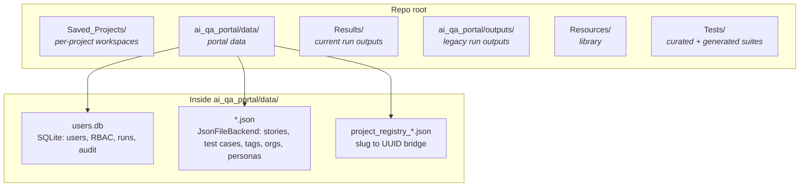

# Storage Layout

How this project saves data on disk: where projects live, where test cases
live, where run outputs land, and how the auth/RBAC store fits in. This doc
is the canonical reference -- if the code changes, update this file.

Last verified against the codebase on Apr 28, 2026.

---

## Quick orientation

If you have one minute and want to know where a thing lives, this table is
the answer. Everything else in this doc is the "why" and the "how".

| Concept | Location | Format |
|---|---|---|
| Project (slug, env list, encrypted creds) | `Saved_Projects/<slug>/config.json` + `project.json` | JSON; password fields Fernet-encrypted |
| Project (UUID identity) | `ai_qa_portal/data/project_registry_<slug>.json` | JSON, links slug to a stable UUID |
| User accounts, RBAC, runs, audit | `ai_qa_portal/data/users.db` | SQLite (six tables, see Layer 2a) |
| User stories | `ai_qa_portal/data/user_story_<uuid>.json` + index | JSON |
| Test cases | `ai_qa_portal/data/test_case_<uuid>.json` + indexes | JSON |
| Tags | `ai_qa_portal/data/tags_<projectUUID>_<name>.json` | JSON |
| Generated `.robot` per test case | `Saved_Projects/<slug>/Tests/Generated/story_<hex12>/<title>_<hex8>.robot` | Robot Framework source |
| Portal orgs (login URL, env type) | `ai_qa_portal/data/orgs.json` | JSON |
| Portal personas (with encrypted creds) | `ai_qa_portal/data/personas.json` | JSON; password Fernet-encrypted |
| Run outputs -- single test (legacy Quick Generate) | `Results/ui_<ts>/{output.xml, log.html, report.html, screenshots}` | Robot artefacts |
| Run outputs -- bulk runs | `Results/bulk_<ts>_<tok>__<tcSlug>_<hex8>[_attemptN]/...` | Robot artefacts |
| Run outputs -- legacy Streamlit / `ScriptRunner` | `ai_qa_portal/outputs/run_<ts>_<short>/` | Robot artefacts |
| Run metadata for project-scoped history | `ai_qa_portal/data/users.db` (`run_records` table) | SQLite |
| LLM keyword catalog (live) | scanned in-memory from `Resources/Common/*.robot` + `Resources/PO/**/*.robot` | dict, mtime-cached |
| LLM keyword catalog (static fallback) | `keyword_catalog.json` at the repo root | JSON |
| Salesforce playbook | `ai_qa_portal/backend/prompts/salesforce_playbook.md` | markdown |
| Legacy LLM system prompt | `system_prompt.txt` at the repo root | plain text |

---

## The two-ID-system decision rule

The codebase uses two project identifiers in parallel: a human-readable
**slug** (e.g. `Pentair`) and a stable **UUID** (e.g.
`b0da1592-b2b1-41d5-bc07-d02e4ee8c5bc`). They both refer to the same
underlying project. The registry file
`ai_qa_portal/data/project_registry_<slug>.json` is the bridge.

> **Decision rule for new code:**
>
> - **Use the slug** when touching `Saved_Projects/`, `users.db.project_memberships.project_slug`, `users.db.run_records.project_slug`, the legacy `project_manager.py` API, or anything that interacts with the filesystem workspace.
> - **Use the UUID** when touching `UserStory`, `TestCase`, `Tag`, `SalesforceOrg`, `Persona`, or any portal-side JSON entity in `ai_qa_portal/data/`.
> - Convert via `ensure_project_uuid(slug)` and `slug_for_project_id(uuid)` in [`ai_qa_portal/backend/project_registry.py`](../ai_qa_portal/backend/project_registry.py).

---

## What never gets committed

This is essential onboarding context: when you clone the repo to a new
machine you start with **no projects, no test cases, no users, no run
history**. That is by design. From [`.gitignore`](../.gitignore):

| Path | Why excluded |
|---|---|
| `Saved_Projects/` | Customer / sandbox credentials and per-tenant test data live here. Never check into a public repo. |
| `ai_qa_portal/data/` | SQLite + per-user JSON; would leak identities, encrypted creds, run history. |
| `ai_qa_portal/outputs/` | Run artefacts (legacy runner). Reproducible from a re-run; large; org-specific. |
| `Results/` | Run artefacts (current runners). Same reasoning as above. |
| `Tests/Generated/` | LLM-generated suites. Regenerated on demand; safe to wipe. |
| `_local_data/` | Bind-mount target used by `docker-compose.yml`. Whatever the live container writes lands here. |
| `.env`, `ai_qa_portal/.env` | API keys, `FERNET_KEY`, Google client secrets. |
| `Resources/TestData/EnvData.robot` | Runtime credential injection point for the legacy Streamlit runner; rewritten on every run. |
| `venv/` | Python virtualenv. |
| `output/`, root-level `log.html`, `output.xml`, `report.html` | Stray Robot outputs when somebody runs `robot` from the repo root by accident. |
| `.cursor/` | IDE / agent state. |

To migrate a working environment, see [Runbook A](#runbook-a----backup-and-restore).

---

## The four storage layers



The four layers, by purpose:

1. **Layer 1 -- `Saved_Projects/<slug>/`** -- per-project filesystem workspace (legacy, slug-keyed, encrypted creds, generated Robot scripts).
2. **Layer 2 -- `ai_qa_portal/data/`** -- portal data (SQLite + JSON). Auth, RBAC, stories, test cases, runs metadata, audit log.
3. **Layer 3 -- `Results/` and `ai_qa_portal/outputs/`** -- run output artefacts (Robot's `output.xml` / `log.html` / `report.html` / screenshots).
4. **Layer 4 -- `Resources/` and `Tests/`** -- the static keyword library plus hand-curated and LLM-generated suites.

All four roots are configurable via env vars in [`ai_qa_portal/backend/config.py`](../ai_qa_portal/backend/config.py):

| Setting | Env var | Default |
|---|---|---|
| `data_dir` | `DATA_DIR` | `<repo>/ai_qa_portal/data` |
| `output_dir` | `OUTPUT_DIR` | `<repo>/ai_qa_portal/outputs` |
| `results_dir` | `RESULTS_DIR` | `<repo>/Results` |
| `saved_projects_dir` | `SAVED_PROJECTS_DIR` | `<repo>/Saved_Projects` |

In Docker / Fly, all four point at a single mounted volume so nothing is
lost across container rebuilds.

---

## Layer 1 -- `Saved_Projects/<slug>/`

The legacy filesystem-backed project store. Every "project" the user
creates from the UI gets a folder here keyed by a slugified name.

### Layout (verified live for the Pentair project)

```
Saved_Projects/
  Astound_Sandbox/
    config.json
    project.json
    Tests/
    Data/
  Pentair/
    config.json          <- credentials per environment + persona (encrypted)
    project.json         <- name, description, created_at, owner_user_id
    Data/                <- CSV / test data uploads
    Tests/
      Generated/
        story_23fef62d6430/
          verify_batch_geocoding_for_existing_acco_aa2db4a3.robot
          verify_fls_for_cmd_team_on_latitude_and__dc6d85e1.robot
          verify_visibility_and_read_only_status_o_34b22d35.robot
```

### `config.json` schema

```json
{
  "environments": {
    "Dev":  { "personas": { "System Admin": { "sandbox_url": "...", "username": "...", "password": "enc::<fernet>", "security_token": "enc::<fernet>", "slack_webhook_url": "" } } },
    "QA":   { "personas": { "System Admin": { ... }, "Sales Manager": { ... } } },
    "UAT":  { ... },
    "Prod": { ... }
  },
  "jira_base_url": "",
  "jira_api_token": "",
  "jira_project_key": ""
}
```

- Sensitive fields (`password`, `security_token`) are wrapped with the
  `enc::` prefix and Fernet-encrypted using the `FERNET_KEY` env var.
  See `_maybe_encrypt` / `_maybe_decrypt` in
  [`project_manager.py`](../project_manager.py).
- Slug rule: anything not `[a-zA-Z0-9_-]` becomes `_`. The slug is what
  shows up under `Saved_Projects/`.
- `project.json` carries the metadata that the slug can't (description,
  creator, etc.).

### Generated Robot scripts

Built by `POST /user-stories/{id}/build-scripts` in
[`ai_qa_portal/backend/routers/user_stories.py`](../ai_qa_portal/backend/routers/user_stories.py).
Layout:

```
Saved_Projects/<slug>/Tests/Generated/story_<storyHex12>/<titleSlug>_<tcHex8>.robot
```

- `<storyHex12>` is the first 12 hex chars of the user-story UUID. All
  scripts for one story sit together.
- `<titleSlug>_<tcHex8>` is a filesystem-safe title prefix plus the first
  8 hex of the test-case UUID for uniqueness.

### `script_path` resolution at run time

`TestCase.script_path` is stored as a path **relative to the repo root**,
e.g. `Saved_Projects/Pentair/Tests/Generated/story_23fef62d6430/verify_x_aa2db4a3.robot`.

The bulk runner resolves it via
`(REPO_ROOT / tc.script_path).resolve()` in
[`ai_qa_portal/backend/routers/runs.py`](../ai_qa_portal/backend/routers/runs.py)
(see `_resolve_or_build_script` near the top of the file).

Important: this means the path is resolved relative to **`REPO_ROOT`**,
not the runner's `os.getcwd()`. Paths stored when the project was on a
different machine still resolve correctly as long as the repo layout is
the same.

---

## Layer 2 -- `ai_qa_portal/data/`

Everything that doesn't fit per-project lives here. Two stores share the
directory: a SQLite database and a JSON file backend.

### Verified live layout

```
ai_qa_portal/data/
  users.db                                                     <- SQLite (Layer 2a)
  orgs.json                                                    <- portal org list
  personas.json                                                <- portal persona list (encrypted creds)
  project_registry_Pentair.json                                <- slug -> UUID mapping (Layer 2c)
  user_story_<storyUUID>.json                                  <- one file per story
  user_stories_by_project_<projectUUID>.json                   <- index per project
  test_case_<tcUUID>.json                                      <- one file per test case
  test_cases_by_story_<storyUUID>.json                         <- per-story index
  test_case_ids_project_<projectUUID>.json                     <- per-project index
  test_case_ids_project_tag_<projectUUID>_<tag>.json           <- per-tag index
  tags_<projectUUID>_<tagName>.json                            <- one per tag
```

---

### Layer 2a -- `users.db` (SQLite, relational)

Connection string is built at import time in
[`ai_qa_portal/backend/services/db.py`](../ai_qa_portal/backend/services/db.py):

```python
def _db_url() -> str:
    data_dir = Path(settings.data_dir)
    data_dir.mkdir(parents=True, exist_ok=True)
    return f"sqlite:///{(data_dir / 'users.db').as_posix()}"
```

#### Table summary

| Table | Purpose |
|---|---|
| `users` | Google-authenticated identities. `id` is the Google `sub` claim. |
| `project_memberships` | RBAC. Composite key `(project_slug, user_id)`. |
| `project_invitations` | Pending invites + access requests. |
| `notifications` | In-app notifications for the bell icon. |
| `run_records` | Run metadata for project-scoped history (joins to users + project_slug). |
| `audit_log` | Append-only event log used by the Admin Console. |

The next four sub-sections cover the things that are easy to get wrong.

#### `users` table -- session revocation semantics

`User.session_revoked_at` is a nullable timestamp. Every authenticated
request runs through `get_current_user` in
[`ai_qa_portal/backend/services/auth.py`](../ai_qa_portal/backend/services/auth.py),
which compares the JWT's `iat` (issued-at) claim to this value:

```python
if user.session_revoked_at is not None:
    if iat_dt < user.session_revoked_at:
        # JWT was issued before the revocation -> reject.
```

Admins set `session_revoked_at = now()` via
`POST /api/admin/users/{id}/revoke-session` (see
[`routers/admin.py`](../ai_qa_portal/backend/routers/admin.py)). Any
session token issued before that wall-clock instant is rejected on the
next request; the user is forced to re-authenticate.

#### `users.global_role` vs `project_memberships.role`

These are two different role systems and they get conflated easily.

- **`global_role`** (column on `users`): the user's default role across
  the portal. Enum: `user` / `tl` / `pm` / `admin`.
- **`project_memberships.role`** (column on `project_memberships`): the
  user's role inside one specific project. Enum: `member` / `lead` / `pm`.

Decision rule in `effective_project_role()` (in `services/auth.py`):

1. If `user.global_role == 'admin'`, the effective role is `pm` for
   every project (admins get cross-project powers).
2. Otherwise look up `(project_slug, user.id)` in `project_memberships`.
3. If no membership row, the user has no access to that project.

In other words: `global_role=admin` is the only role that grants
cross-project authority. `tl` and `pm` as global roles are defaults only;
a project membership row always wins for that project.

#### TL vs PM permissions

Both roles appear inside `project_memberships`. They're easy to conflate.
This table is the source of truth, verified against the route guards in
[`routers/memberships.py`](../ai_qa_portal/backend/routers/memberships.py),
[`routers/projects.py`](../ai_qa_portal/backend/routers/projects.py), and
[`routers/invitations.py`](../ai_qa_portal/backend/routers/invitations.py):

| Action | member | lead (TL) | pm |
|---|---|---|---|
| View project, list members, list envs | yes | yes | yes |
| Invite a new member as `member` or `lead` | no | yes | yes |
| Approve an access-request to become `member` or `lead` | no | yes | yes |
| Revoke / re-send an invite | no | yes | yes |
| Invite a new member as `pm` | no | no | yes |
| Approve an access-request to become `pm` | no | no | yes |
| Change another member's role | no | no | yes |
| Remove a member from the project | no | no | yes |
| Update project metadata (description, etc.) | no | no | yes |
| Delete the project | no | no | yes |
| Last-PM constraint (cannot demote/remove the only PM) | n/a | n/a | enforced |

> **Mnemonic:** TL handles people-flow at the member/lead tier. PM owns
> the project itself and the PM tier.

The "last-PM constraint" lives in
[`routers/memberships.py`](../ai_qa_portal/backend/routers/memberships.py)
and returns a 409 with the message
`Cannot demote the last PM of this project. Promote another member to PM first.`

#### `project_invitations` -- direction and status enums

This single table stores both invite-out (PM -> user) and request-in
(user -> project) flows. Distinguishing them by a column avoids needing
two tables.

`InvitationDirection`:

| Value | Meaning |
|---|---|
| `invite` | PM/TL sent this to a prospective member. Awaiting user accept. |
| `request` | User asked to join this project. Awaiting PM/TL approval. |

`InvitationStatus`:

| Value | Meaning |
|---|---|
| `pending` | Invite sitting in the recipient's notifications. |
| `requested` | Self-service access request waiting for PM/TL approval. |
| `accepted` | Recipient accepted the invite. Terminal. |
| `approved` | PM/TL approved the request; membership row created. Terminal. |
| `rejected` | Recipient or approver rejected. Terminal. |
| `revoked` | Sender cancelled before action. Terminal. |
| `expired` | Passed `expires_at` without action. Terminal. |

#### `audit_log` -- which events are emitted today

The schema supports any `(action, target_type, target_id, metadata)`
tuple, but only five `action` values are actually emitted by the
codebase as of this writing (verified via grep over
`ai_qa_portal/backend/`):

| `action` | Where it fires |
|---|---|
| `admin_patch_user` | Admin edits a user (role, active flag) via `/api/admin/users/{id}` |
| `admin_revoke_session` | Admin revokes someone's session via `/api/admin/users/{id}/revoke-session` |
| `admin_transfer_projects` | Admin transfers PM ownership from one user to another |
| `run_started` | Bulk run begins (one row per run, not per test case) |
| `run_finished` | Bulk run completes |

> **Known gap:** persona create/rotate/reveal events and invitation
> lifecycle events are **not** audit-logged today, even though the
> schema supports it. Don't assume the audit log is a complete
> tamper-evidence record -- it covers admin actions and run lifecycle
> only.

---

### Layer 2b -- `JsonFileBackend` JSON files

Implementation in
[`ai_qa_portal/backend/storage/json_file_backend.py`](../ai_qa_portal/backend/storage/json_file_backend.py).
One file per logical key, with separate **index files** for cheap list
operations.

#### Path-encoding rule

Windows can't have `:` in filenames, so the backend rewrites separators:

```python
def _safe_key(key: str) -> str:
    return key.replace("/", "_").replace("\\", "_") \
              .replace(":", "_").replace("?", "_").replace("*", "_")
```

So the logical key `test_case:23fef62d-6430-...` maps to the file
`test_case_23fef62d-6430-....json`.

#### Index files are explicit, not derived

Adding a test case writes the per-row file AND appends to every index
the row participates in. Each index file is a flat list of UUIDs:

```json
{
  "ids": [
    "23fef62d-6430-4ff2-840b-b2a489b9e205",
    "05b55f1d-36de-4e36-980b-fcc26c5ba9c6",
    "aa2db4a3-9514-49cb-a806-70ea1a86154d"
  ]
}
```

For one test case row, **three** index files get appended:

- `test_cases_by_story_<storyUUID>.json` -- "all test cases under this story"
- `test_case_ids_project_<projectUUID>.json` -- "all test cases in this project"
- `test_case_ids_project_tag_<projectUUID>_<tagName>.json` -- once per tag the case carries

This means listing "all approved test cases tagged Smoke for project X"
is one index read plus N row reads, no scan over the entire data
directory.

#### Why test cases are JSON, not SQLite

The user-stories / test-cases work was iterating quickly during Phase 2
of the RBAC rollout; new fields (`script_path`, `heal_attempts`,
`last_healed_at`) were added several times. JSON tolerates schema
additions without migrations. `run_records` went into SQLite because
they need cross-project aggregate queries (run history, recent runs by
member) that scanning N JSON files can't serve cheaply.

#### Personas and orgs are special

`personas.json` and `orgs.json` aren't one-file-per-row; each is a
single file with an `items: [...]` array. Visibility model (private /
public) and Fernet-encrypted passwords live in the row data. Done this
way because the row count is small (dozens, not thousands) and the
visibility filter is applied per-request anyway.

---

### Layer 2c -- the slug ↔ UUID bridge

[`ai_qa_portal/backend/project_registry.py`](../ai_qa_portal/backend/project_registry.py)
maintains a stable UUID for every `Saved_Projects/` slug:

```
ai_qa_portal/data/project_registry_<slug>.json
```

```json
{ "project_id": "b0da1592-b2b1-41d5-bc07-d02e4ee8c5bc", "slug": "Pentair" }
```

This file is the join key that lets portal entities (UserStory,
TestCase, etc.) all carry `project_id: UUID` while filesystem code keeps
using the slug. See the [decision rule above](#the-two-id-system-decision-rule)
for which to use when.

---

## Layer 3 -- run output artefacts

Every Robot run writes to a folder of artefacts. Three different runners
write to two different roots; understand which is which.

### `Results/` -- current runners

Folders here are **flat siblings**, never nested. This is required
because the file-serving endpoint
`GET /api/runs/{run_folder}/file/{filename}` rejects any `/` in
`run_folder` (see `_resolve_run_dir` in
[`routers/runs.py`](../ai_qa_portal/backend/routers/runs.py)).

#### Single-test runs (Generate page top section, SSE-streamed)

```
Results/ui_<YYYYMMDD>_<HHMMSS>/
  output.xml
  log.html
  report.html
  selenium-screenshot-1.png
  selenium-screenshot-2.png
  ...
```

#### Bulk runs (Story Execution Panel)

```
Results/bulk_<ts>_<token>__<tcSlug>_<tcHex8>[_attemptN]/
  output.xml
  log.html
  report.html
  selenium-screenshot-*.png
```

- All sibling folders sharing the same `bulk_<ts>_<token>__` prefix
  belong to the same bulk run.
- Each test case in the bulk gets its own folder.
- With auto-heal: `_attempt2`, `_attempt3` suffixes preserve the prior
  attempt's `output.xml` as evidence the LLM healer reads.
- The screenshot files (`selenium-screenshot-*.png`) are exactly what
  the failure diagnoser feeds back to the LLM healer.

The `RunRecord` row in `users.db` carries
`run_folder = "bulk_..._verify..._29d2cabb"` so the run history endpoint
can join file-serving paths to project membership for RBAC.

### `ai_qa_portal/outputs/` -- legacy `ScriptRunner`

```
ai_qa_portal/outputs/run_<ts>_<short>/
  ... robot artefacts ...
```

This is the output target for `ScriptRunner.run()` in
[`services/script_runner.py`](../ai_qa_portal/backend/services/script_runner.py),
which is the runner used by the legacy Streamlit flow and the older
`/run` POST endpoint. Distinct from `Results/`, which is owned by the
modern bulk and SSE-streaming runners.

> **Status: legacy.** New code should not target `ai_qa_portal/outputs/`.
> The two output roots will likely consolidate into `Results/` in a
> future cleanup; until then, expect to see runs in either place
> depending on which endpoint triggered them.

---

## Layer 4 -- `Resources/` and `Tests/`

```
Resources/
  Common/
    GlobalKeywords.robot         <- 171 keywords; the AI's primary palette
    GlobalLocators.robot         <- XPath constants
    GlobalVariables.robot        <- defaults
    GlobalApi.robot              <- REST seeding/teardown
    LucyChatBot/
      LucyChatBotCommon.robot
  PO/
    Platform/SalesPO.robot
    Platform/ContactPO.robot
    Platform/WorkOrdersPO.robot
    LucyChatBot/PartsPO.robot
    LucyChatBot/ServiceAppointmentsPO.robot
    LucyChatBot/ServiceContractsPO.robot
    LucyChatBot/WarrantiesPO.robot
  TestData/
    EnvData.robot                <- WRITTEN AT RUN TIME by run_test.py / Streamlit
    Platform/PlatformData.robot
    Platform/SalesData.robot
    LucyChatBot/...
Tests/
  Platform/Sales.robot           <- hand-curated suites
  SmokeTests/Smoke_Lead_Lifecycle.robot
  Generated/
    temp_test.robot              <- Quick Generate's single output target
```

Two important details:

### `Tests/Generated/temp_test.robot` -- single-file global mutex

The Quick Generate path
([`generate_test_from_prompt`](../ai_bridge.py) in `ai_bridge.py`)
writes its output to **a single fixed path**, `Tests/Generated/temp_test.robot`,
regardless of caller. That file is overwritten on every Quick generation.

> **Warning:** Two concurrent Quick Generate sessions will corrupt each
> other's output. The first to finish gets clobbered by the second.
>
> Mitigations available today: none in code. The frontend should
> serialise Quick generations per user (one in-flight at a time). The
> long-term fix is to make the Quick path write to a per-request unique
> path; not built yet.

### `Resources/TestData/EnvData.robot` is runtime state, not source

This file is rewritten on every legacy run by
`run_test.write_envdata(sandbox_url, username, password)`. It exists in
`.gitignore` for that reason. The bulk runner deliberately does **not**
write to it (race-condition-prone with parallel suites) and uses
`robot --variable` instead.

---

## The keyword catalog -- live scan vs static fallback

The four LLM entry points (drafter, builder, quick, stepwise) all need
the list of available Robot keywords as JSON in their prompts.

### How it works

[`ai_qa_portal/backend/services/keyword_catalog.py`](../ai_qa_portal/backend/services/keyword_catalog.py)
exposes `build_catalog()`. On each call:

1. Scan `Resources/Common/*.robot` and `Resources/PO/**/*.robot` to
   collect every keyword name + `[Documentation]` + `[Arguments]` +
   `[Tags]`.
2. Compute a signature: a tuple of `(path, mtime_ns)` for every file
   read.
3. If the signature matches the cached one, return the cached catalog.
   Otherwise re-scan and replace the cache.
4. If the scan returns zero keywords (e.g. someone moved `Resources/`
   on disk), fall back to the static
   [`keyword_catalog.json`](../keyword_catalog.json) at the repo root.

That static file is a snapshot from before the live scanner existed;
keep it as a safety net but treat it as drift-prone.

### Cache scope caveat (multi-worker)

The cache lives in module-level globals (`_cache`, `_cache_signature`)
protected by a `threading.Lock`. That makes it **process-global, not
server-wide.** Each Uvicorn worker has its own copy. After editing a
`*.robot` file:

- The worker that handles the next request will rescan (its mtime
  signature no longer matches).
- Other workers will rescan on their next catalog read.
- There is no cross-worker invalidation signal, but mtime checking
  means every worker converges to the new catalog within one request
  cycle each.

In dev (single Uvicorn worker on `--reload`), this is invisible. In
production with `--workers N > 1`, you may briefly see one worker emit
prompts using the old catalog while another already has the new one.
Acceptable for the current scale; revisit if it ever causes a real bug.

---

## Runbook A -- Backup and restore

### What to copy when migrating to a new machine

```
Saved_Projects/                          (per-project workspaces, encrypted creds)
ai_qa_portal/data/                       (SQLite + portal JSON)
```

That's all the user-generated state. `Resources/`, `Tests/`,
`ai_qa_portal/`, and code at the repo root all come from `git`.

### What MUST stay in sync across machines

| Secret | Why |
|---|---|
| `FERNET_KEY` env var | Without the same value, encrypted `password` and `security_token` fields in `config.json` and `personas.json` won't decrypt. The data is irrecoverably lost. |
| `GOOGLE_CLIENT_ID` / `GOOGLE_CLIENT_SECRET` | NextAuth on the frontend won't authenticate against a different OAuth client. |
| `AUTH_SECRET` (frontend `.env.local`) | If you generate a new one on the new machine, every existing session token becomes invalid -- users have to sign in again, which is acceptable. |

### Cold migration order of operations

1. Stop both backend and frontend on the source machine.
2. `tar`/copy `Saved_Projects/` and `ai_qa_portal/data/` to the destination.
3. Copy `.env` (or at least `FERNET_KEY` + `GOOGLE_CLIENT_ID` +
   `GOOGLE_CLIENT_SECRET`) to the destination.
4. Bring up the backend on the destination and verify `/health` returns
   `200 {"status":"ok"}`.
5. Sign in to verify auth works against the migrated `users.db`.
6. Run a generate-scripts on a known story to verify `script_path`
   resolution works.

### Container rebuild

> **WARNING -- the `-v` flag matters:**
>
> | Command | Effect on volumes |
> |---|---|
> | `docker compose down` | Stops containers. Named + bind-mount volumes ARE PRESERVED. Safe. |
> | `docker compose down -v` | Stops containers AND **WIPES named volumes**. Bind-mounted host paths survive. **All data in named volumes is lost.** |
> | `docker compose up --build -d` | Rebuilds the image. Volumes (named or bind) are unaffected. Safe. |
>
> Rule of thumb: **never type `down -v` in this repo unless you genuinely
> want to start over from scratch.** If you only need a fresh build,
> `down` (no flag) followed by `up --build -d` is the right sequence.

---

## Runbook B -- Slug rename (manual)

There's no automated rename helper today. Renaming
`Saved_Projects/<old>/` to `Saved_Projects/<new>/` orphans three
different stores; here's the manual procedure.

### Steps

1. **Stop the backend.** Don't do this with the server running.

2. **Rename the directory:**
   ```bash
   mv Saved_Projects/<old> Saved_Projects/<new>
   ```

3. **Update SQLite `project_memberships`:**
   ```bash
   sqlite3 ai_qa_portal/data/users.db
   sqlite> UPDATE project_memberships SET project_slug='<new>' WHERE project_slug='<old>';
   sqlite> .exit
   ```

4. **Rename the registry file** to preserve the project's UUID:
   ```bash
   mv ai_qa_portal/data/project_registry_<old>.json \
      ai_qa_portal/data/project_registry_<new>.json
   ```
   Then edit the file and update its `slug` field:
   ```json
   { "project_id": "...", "slug": "<new>" }
   ```

5. **Update `RunRecord` rows** so run history and file-serving still
   resolve:
   ```bash
   sqlite3 ai_qa_portal/data/users.db
   sqlite> UPDATE run_records SET project_slug='<new>' WHERE project_slug='<old>';
   sqlite> .exit
   ```

6. **Restart the backend** and verify:
   - The project list shows `<new>`.
   - A known run still serves `log.html` via
     `GET /api/runs/{folder}/file/log.html`.
   - `Saved_Projects/<new>/Tests/Generated/...` paths still resolve when
     you trigger a bulk run.

If any of these steps is skipped, expect:

- Skipped step 3: the original PM/members can no longer see the project
  (the membership row points at a slug that no longer exists).
- Skipped step 4: every UserStory / TestCase / Tag / Persona / Org for
  this project becomes inaccessible (the UUID-keyed entities can't find
  their slug for filesystem operations).
- Skipped step 5: run history shows the project's runs as orphaned, and
  the runs page may not load them under the new slug.

---

## Runbook C -- Index repair

If you hand-edit `ai_qa_portal/data/*.json`, indexes can drift. Symptom
patterns and how to fix.

### Diagnose

```
Symptom: a test case is visible at GET /test-cases?user_story_id=...
         but missing from the bulk panel's tag dropdown.
Cause:   the per-tag index file was hand-edited or got out of sync.

Diagnose:
  1. Find the test case's row file:
       ai_qa_portal/data/test_case_<uuid>.json
  2. Note its `tags` array.
  3. For each tag, open the matching index file:
       ai_qa_portal/data/test_case_ids_project_tag_<projectUUID>_<tag>.json
  4. Confirm the test case's UUID is in the `ids` array.
```

### Repair

There's no automated tool today; remediation is manual. Append the
test case UUID to the relevant index files and save.

> **The fix takes effect immediately. NO BACKEND RESTART NEEDED.**
> `JsonFileBackend` re-reads every JSON file on demand (see `read()` at
> line 30 of
> [`json_file_backend.py`](../ai_qa_portal/backend/storage/json_file_backend.py));
> there is no in-memory cache of index contents to invalidate.

### How to prevent this happening

- Never edit `ai_qa_portal/data/*.json` by hand. Always go through the
  API endpoints (`PATCH /test-cases/{id}`, `POST /tags`, etc.) which
  keep all index files coherent.
- If you must hand-edit (e.g. fixing data from a botched script), edit
  one row file at a time and update every index file the row
  participates in (per-story, per-project, per-tag).

---

## Runbook D -- Credential sync rationale

Two parallel credential systems exist in this codebase, and the sync
between them is one-way. The "why" matters because hand-editing one
side breaks assumptions.

### The two systems

```
Saved_Projects/<slug>/config.json
  (legacy, slug-keyed, per-environment, per-persona, Fernet-encrypted)
                |
                | sync_project_from_config(project_id) -- one-way only
                v
ai_qa_portal/data/personas.json + orgs.json
  (portal, UUID-keyed, lazily mirrored)
```

Sync logic in
[`ai_qa_portal/backend/services/legacy_creds_sync.py`](../ai_qa_portal/backend/services/legacy_creds_sync.py).
It runs on every `GET /orgs?project_id=...` and
`GET /personas?project_id=...` to lazily mirror new entries.

### Why one-way

`config.json` is the **authoritative source**. The portal personas and
orgs are a **cached projection**.

- The legacy filesystem store predates the portal Persona/Org model.
- Migrating `config.json` into `personas.json` wholesale would break
  the Streamlit app and the `run_test.py` CLI, which still read
  `config.json` directly.
- Sync runs lazily so a hand-edit of `config.json` shows up the next
  time the bulk panel is opened, with no explicit migration step.

### What breaks if you rotate a password through the portal UI only

Suppose you rotate a persona's password via the portal UI:

- The portal write goes ONLY to `personas.json`. `config.json` is
  unchanged.
- The next `GET /personas` call will NOT clobber your portal change --
  the sync skips any persona row that already exists in the portal
  store.
- BUT `run_test.py` and the legacy Streamlit flow still read
  `config.json`, so they'll keep using the OLD password.

### The right way to rotate a password today

Either:

- **(a)** Edit `config.json` AND `personas.json` (manually, in two
  places).
- **(b)** Edit `config.json` only and DELETE the corresponding row in
  `personas.json` so the next sync re-creates it from `config.json`.

### Future improvement (not built)

A "portal -> legacy writeback" path is documented as a known limitation
at the top of
[`legacy_creds_sync.py`](../ai_qa_portal/backend/services/legacy_creds_sync.py).
Until it lands, hand-edit both files when rotating credentials.

---

## Practical implications cheatsheet

- **`FERNET_KEY` is the master secret.** Lose it and every encrypted
  `password` / `security_token` in `Saved_Projects/<slug>/config.json`
  and `personas.json` becomes unreadable. Keep it identical across all
  dev / prod boxes.
- **Two parallel credential systems exist** -- don't be surprised. See
  [Runbook D](#runbook-d----credential-sync-rationale).
- **Indexes are explicit, not derived.** If you hand-edit a JSON row
  file, the per-story / per-tag indexes won't pick up your change. See
  [Runbook C](#runbook-c----index-repair).
- **Slug stability matters.** Renaming a slug orphans three stores
  unless you follow [Runbook B](#runbook-b----slug-rename-manual).
- **Run folders are flat under `Results/`** specifically so the
  file-server endpoint can serve their `log.html` / `report.html` /
  screenshots over HTTP without path-traversal complications.
- **Backend reload picks up `Resources/*.robot` changes automatically**
  via the keyword catalog scanner's mtime checking. No restart required
  unless you also added a Python source file.
- **Do not commit `Saved_Projects/`, `ai_qa_portal/data/`, `Results/`,
  `ai_qa_portal/outputs/`, `Tests/Generated/`, or any `.env` file.**
  See the [What never gets committed](#what-never-gets-committed) table.
